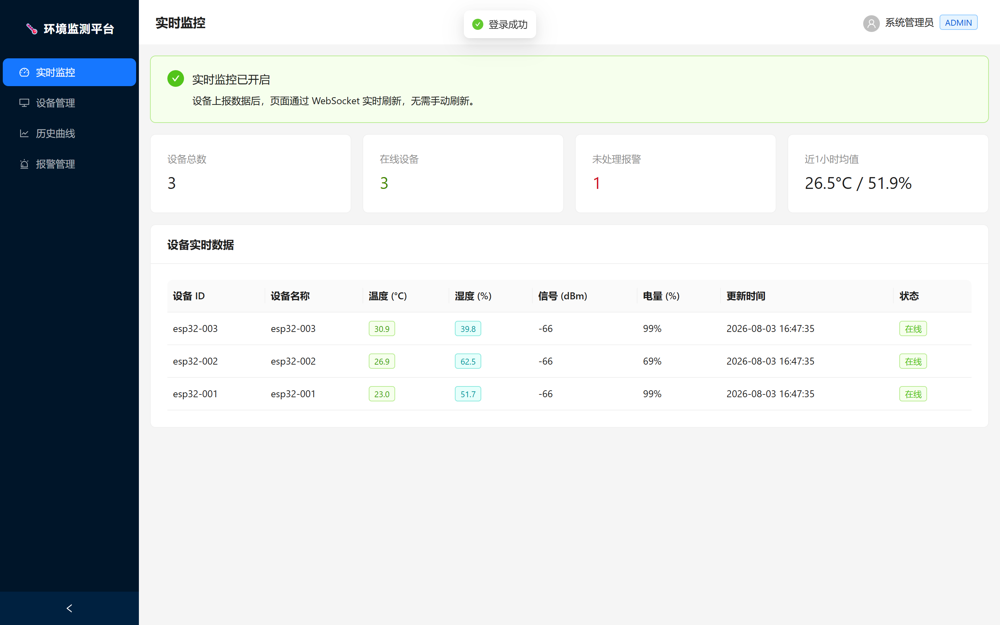
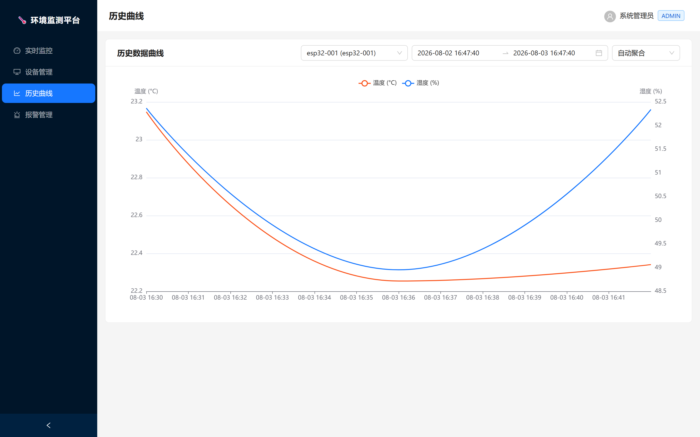
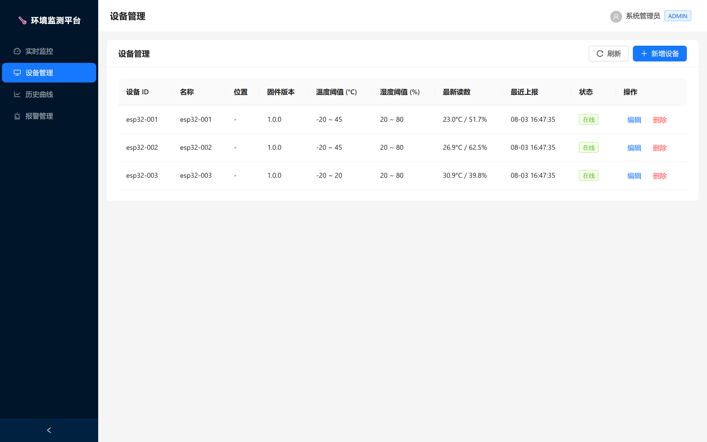
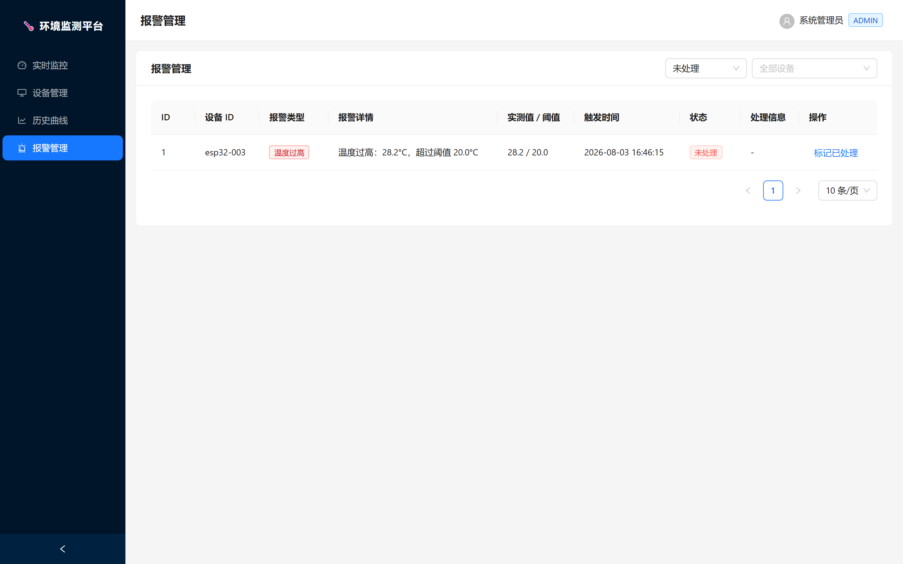
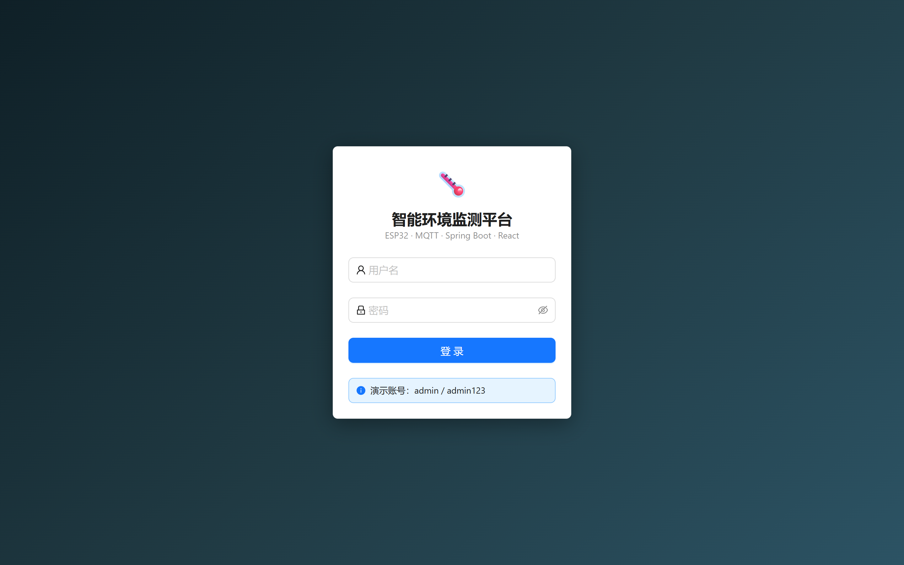
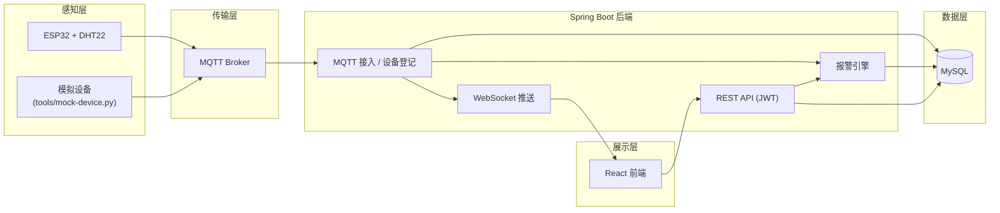

# 🌡️ 智能环境监测平台（IoT Smart Environment Monitoring Platform）

一个基于 **ESP32 + MQTT + Spring Boot + React + MySQL** 的全栈物联网环境监测平台，实现设备数据采集、实时监控、历史曲线、报警管理与设备管理，支持从真实硬件到模拟数据的完整链路演示。

> 本仓库由「温湿度监测器」重构升级而来，适合 GitHub 开源展示与秋招项目作品集。

---

## ✨ 功能特性

| 模块 | 能力 |
| --- | --- |
| 数据采集 | ESP32 + DHT22 固件，MQTT 协议上报；无硬件时可运行模拟设备脚本 |
| 实时监控 | WebSocket (STOMP) 实时推送，仪表盘自动刷新，设备在线/离线状态 |
| 历史曲线 | ECharts 双轴曲线，支持时间范围与聚合粒度选择 |
| 报警管理 | 温度/湿度上下限阈值报警，自动触发、自动恢复闭环、人工处理 |
| 设备管理 | 设备自动注册、增删改查、阈值配置、固件版本与信号强度展示 |
| 用户登录 | JWT 无状态鉴权 + BCrypt 密码加密 |
| 部署运维 | Docker Compose 一键全栈部署，Flyway 数据库迁移，Nginx 反向代理 |

## 🖥️ 界面预览

| 实时监控 | 历史曲线 |
| --- | --- |
|  |  |

| 设备管理 | 报警管理 |
| --- | --- |
|  |  |

| 用户登录 |
| --- |
|  |

## 🏗️ 技术栈

| 层级 | 技术 |
| --- | --- |
| 感知层 | ESP32 (Arduino/PlatformIO)、DHT22 |
| 传输层 | MQTT 协议、Eclipse Mosquitto |
| 服务层 | Java 17、Spring Boot 3.3、Spring Security (JWT)、Spring Data JPA、Eclipse Paho、WebSocket/STOMP |
| 数据层 | MySQL 8、Flyway |
| 展示层 | React 18、Vite、Ant Design 5、ECharts、Axios、@stomp/stompjs |

## 🗺️ 系统架构



详细设计（数据流时序图、关键机制）见 [docs/architecture.md](docs/architecture.md)。

## 📁 项目结构

```
env-monitor/
├── backend/                  # Spring Boot 后端
│   └── src/main/java/com/iot/envmonitor/
│       ├── controller/       # REST 接口
│       ├── service/          # 业务逻辑
│       ├── mqtt/             # MQTT 接入
│       ├── security/         # JWT 鉴权
│       ├── config/           # 安全 / WebSocket / 初始化
│       ├── entity/           # JPA 实体
│       ├── repository/       # 数据访问层
│       ├── dto/              # 传输对象
│       └── logic/            # 纯逻辑（报警判定）
├── frontend/                 # React 前端
│   └── src/
│       ├── pages/            # 登录 / 监控 / 设备 / 历史 / 报警
│       ├── components/       # 布局
│       ├── api/              # Axios 封装
│       ├── auth/             # 登录态
│       └── realtime/         # WebSocket 实时数据
├── firmware/                 # ESP32 固件（PlatformIO）
│   ├── include/config.example.h
│   └── src/main.cpp
├── tools/                    # 模拟设备脚本
├── deploy/                   # 运维配置（Mosquitto 等）
├── docs/                     # 架构 / API / 部署文档
├── docker-compose.yml        # 一键部署
└── README.md
```

## 🚀 快速开始

### 方式一：Docker Compose 一键部署（推荐）

需要 Docker 与 Docker Compose。

```bash
docker compose up -d --build
```

启动完成后访问：

| 服务 | 地址 |
| --- | --- |
| 前端控制台 | http://localhost |
| 后端 API | http://localhost:8080/api |
| MQTT Broker | localhost:1883 |

默认账号：`admin / admin123`

### 方式二：本地开发模式

**1. 启动基础设施（MySQL + Mosquitto）**

```bash
docker compose up -d mysql mosquitto
```

**2. 启动后端**

```bash
cd backend
mvn spring-boot:run
```

> 不想安装 MySQL？使用 H2 内存数据库直接跑：
> `mvn spring-boot:run -Dspring-boot.run.profiles=dev`

**3. 启动前端**

```bash
cd frontend
npm install
npm run dev
```

浏览器访问 http://localhost:5173 ，使用 `admin / admin123` 登录。

### 4. 产生数据

无真实硬件时，用模拟脚本向 MQTT 发布数据（默认带随机高温尖峰，便于演示报警）：

```bash
pip install paho-mqtt
python tools/mock-device.py --devices 3 --interval 5
```

## 🔌 硬件接入（ESP32）

接线：DHT22 数据脚 → ESP32 GPIO4（可在 `config.h` 修改），VCC → 3V3，GND → GND。

```bash
cd firmware
cp include/config.example.h include/config.h   # 填写 WiFi / MQTT 配置
platformio run -t upload
```

固件会自动使用 MAC 地址生成唯一设备 ID（如 `esp32-12AB34`）并上报到 `env/<设备ID>/telemetry`，后端首次收到消息即自动注册设备。详细说明见 `firmware/src/main.cpp` 注释。

## 📚 接口文档

完整的 REST API 说明、请求/响应示例见 [docs/api.md](docs/api.md)。接口概览：

| 方法 | 路径 | 说明 |
| --- | --- | --- |
| POST | `/api/auth/login` | 登录获取 JWT |
| GET | `/api/auth/me` | 当前用户 |
| GET/POST | `/api/devices` | 设备列表 / 新增 |
| PUT/DELETE | `/api/devices/{id}` | 更新 / 删除设备 |
| GET | `/api/devices/{id}/data` | 历史数据（支持聚合） |
| GET | `/api/alarms` | 报警列表（分页、过滤） |
| PUT | `/api/alarms/{id}/resolve` | 处理报警 |
| GET | `/api/dashboard/summary` | 仪表盘汇总 |
| WS | `/ws` (STOMP) | 订阅 `/topic/telemetry` 实时数据 |

## 📖 更多文档

- [系统架构设计](docs/architecture.md)
- [接口文档](docs/api.md)
- [部署说明](docs/deployment.md)

## 🧭 后续规划

- 多租户与角色权限（普通用户/管理员）
- 邮件、钉钉、企业微信报警通知
- 时序数据库（InfluxDB/TimescaleDB）支撑百万级点位
- 传感器固件 OTA 升级

## 📄 License

[MIT](LICENSE)
