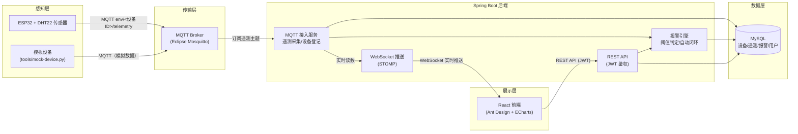
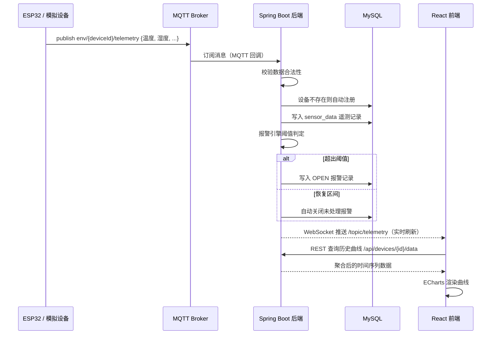
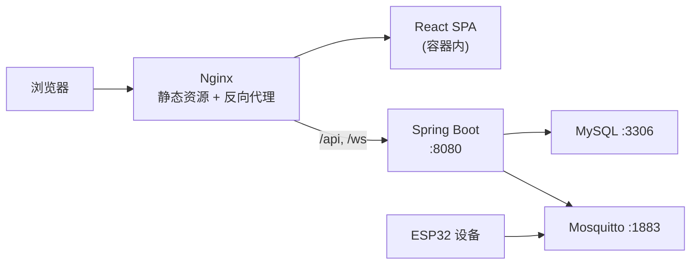

# 系统架构设计

## 1. 总体架构

## 2. 数据流（一次完整的遥测上报）

## 3. 关键设计

### 3.1 设备自动注册与在线判定

- 设备首次上报时，后端按 `deviceId` 自动创建设备记录，无需手工录入；
- 设备表维护 `last_seen` 字段，超过 120 秒未上报即判定为离线（前端按时间实时计算）；
- 前端通过 WebSocket 实时订阅最新读数，离线/在线状态无需刷新页面即可更新。

### 3.2 报警引擎

- 每台设备独立配置温度、湿度上下限阈值；
- 采用「事件触发 + 状态闭环」模型：超阈值生成 `OPEN` 报警，恢复区间后自动闭环为 `RESOLVED`，也支持人工标记处理；
- 同一类型报警未处理期间不会重复产生（幂等），避免报警风暴。

### 3.3 历史数据聚合

- 历史曲线接口支持按时间窗口聚合（自动或手动指定粒度），将海量原始点降采样为可读曲线；
- 当前在应用层聚合，适合中小规模部署；规模化后可替换为数据库侧聚合或时序数据库。

### 3.4 安全设计

- 登录使用 BCrypt 加盐哈希存储密码；
- 接口采用 JWT（HS256）无状态鉴权，Spring Security 过滤器统一校验；
- 支持 CORS 白名单配置，前后端分离部署时按需放行来源。

## 4. 部署拓扑

单机 `docker compose up` 即可完成全栈部署；也可将各组件独立部署到不同主机。
